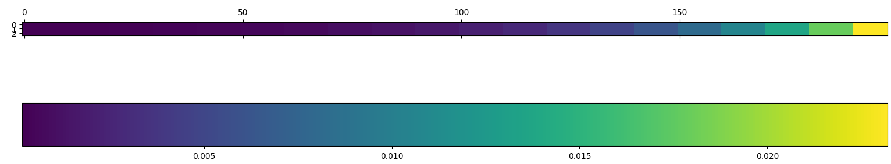
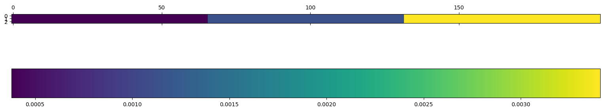

# Nesy

## Synthetic Data

All the code to generate the different scenarios are in the folder /markov_chain. 

You can generate several CTS for each scenario by changing the name line 8 (or 7) and the seed parameter line 22 (or 17).

## Raw Logs Dataset

Logs always need preprocessing before use. For instance, windows logs are stored in evtx files and needs an extraction its own.

However, all the other types of logs are stored in text files .log, and need a parsing with regex. To this end, we use the library logparser from logpai that we referenced in our paper.

All the code for this preprocessing are stored in /dataset/raw_logs_dataset and there is one converter for each type of logs. There is also one file to convert the resulting csv to parquet file. 

## Logs Dataset

You can convert the logs to CTS thanks to the /dataset/logs2temporal_cts.py and /dataset/temporal_cts2cts.py files. 

## State Space intersection

You always need several CTS in the same categories to run the algorithm. (You can generate them with the instructions above.) 

However, there may be a distinct set of categories due to the randomness of real world systems. In order to tackle this problem, we provide the script intersect_cts_state_space.py.

## Running Nesy Algorithm
- In initialize.py : change the files name to choose the cts you want to analyze.
- Run initialize.py
- If you run nesy on the synthetic dataset, uncomment line 29, and comment line 27.
- While Tailored AMI or Jaccard Index is high enough :
  - Write a True in the list line 21 at the index of the matching couple.
  - Run one_step.py 
  - Run summary_clustering_state.py to see the state of the clustering.

# Description of the synthetic scenarios

- MC scenario 1 have been designed to mimic the behavior of the logs. 
There are elements with huge probability to repeat over and over. 
The opposite goes with other elements, which leads to steady increase 
in the diagonal of the transition matrix in te next Figure.

There are also elements that often appear whatever the last element, 
and other elements for which it is the opposite. 
It explains the gradation outside of the diagonal in the next Figure.

- MC scenario 2 is like MC scenario 1 but with no gradation 
outside of the diagonal, as it can be seen in the next two Figures.

As a result, the frequencies are less well separated than in 
MC scenario 1. 

- On the opposite, MC scenario 3 is like 
MC scenario 1 but with no gradation in the diagonal as it 
can be seen in the next two Figures. 

Then, the frequencies here are more separated than in MC scenario 1.

- We have the same transition matrix for the underlying markov chain 
of HMM scenario 1 and HMM scenario 2 :

$$\begin{pmatrix} 0.5 & 0.3 & 0.2 \\ 0.1 & 0.6 & 0.3 \\ 0.4 & 0.1 & 0.5 \end{pmatrix}$$~~

However, the emission matrices are different and are shown 
in the next Figures. 

For HMM scenario 1, the probabilities are exponentially increasing with a little granularity, 
whereas there are 3 big groups of same probabilities for HMM scenario 2. 
Thus, frequencies are totally separated in HMM scenario 1, 
even more than MC scenario 3. 
As a results, Nesy will perform best on this scenario. 
Moreover, frequencies are well-separated by groups in HMM scenario 2, 
but not inside of these groups. 
It leads to a Nesy that works well at the beginning, 
but not at the end when clusters are littler than those groups 
of frequencies.
